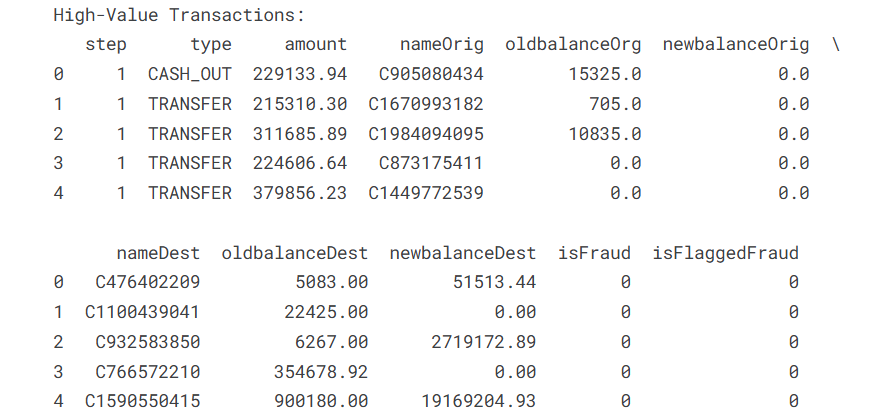
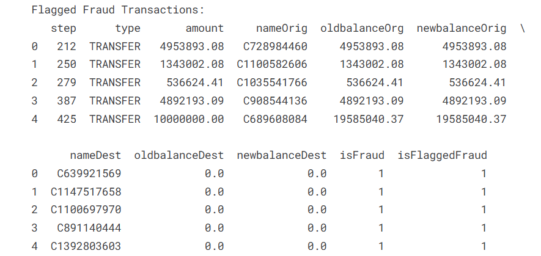
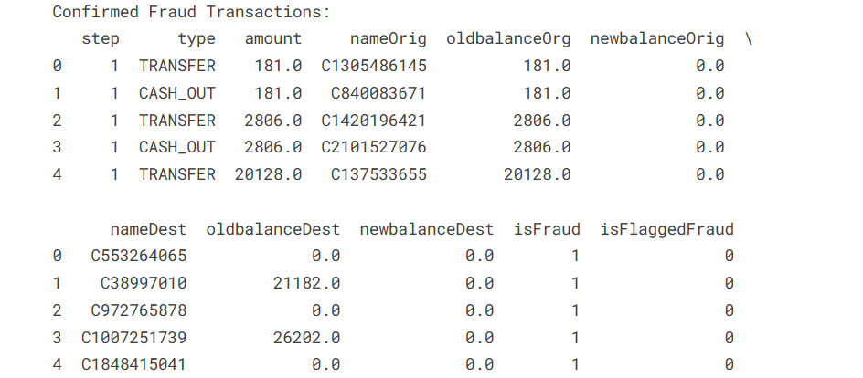
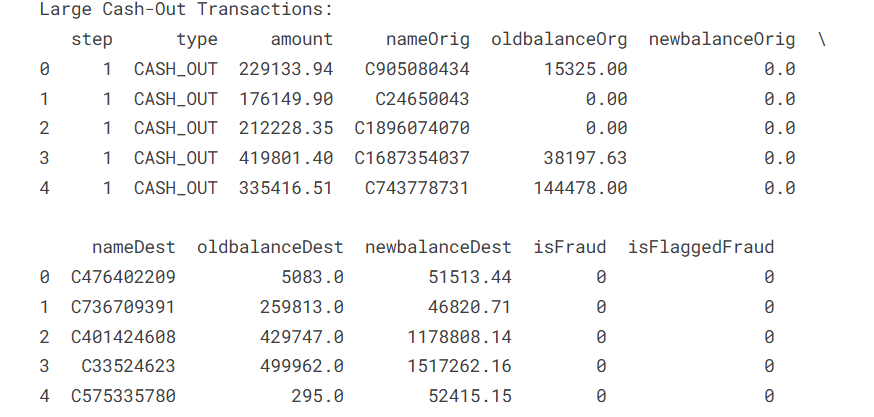
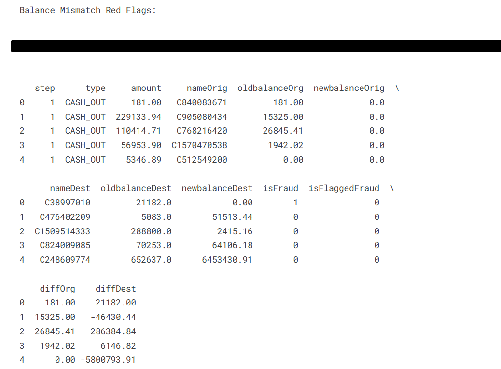
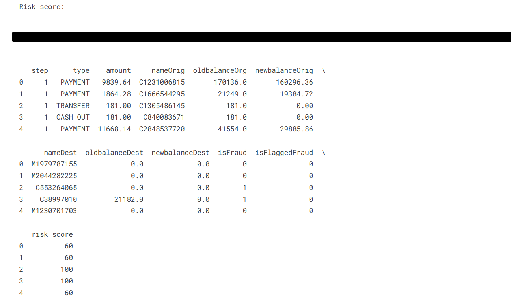
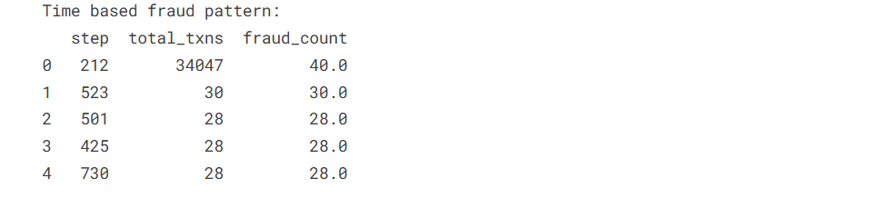

# Red Flag Detection in Vendor Payments Using SQL

## 📌 Project Overview
This project simulates an internal audit scenario where SQL is used to detect red flags in vendor payments. It demonstrates how data analytics can support fraud risk assessment and control testing, aligned with ISA 240 and ISA 315.

## 🎯 Objective
To identify potentially suspicious transactions—such as duplicate invoices, weekend payments, and round-amount anomalies—using rule-based SQL queries.

## 🧰 Tools Used
- SQL (BigQuery / PostgreSQL / MySQL)
- Kaggle (for notebook execution)
- GitHub (for version control and documentation)

## 🧠 Red Flag Rules Implemented
- Duplicate invoice numbers
- Payments made on weekends
- Round-amount transactions
- High-value payments above threshold
- Multiple payments to same vendor in short time

## 🔍 Audit Relevance
This project reflects procedures aligned with:
- **ISA 240**: The Auditor’s Responsibilities Relating to Fraud
- **ISA 315**: Identifying and Assessing the Risks of Material Misstatement
- **ISA 330**: Auditor Responses to Assessed Risks

## 🧠 Professional Judgment
Each flagged transaction would be subject to further investigation. For example:
- Duplicate invoices may indicate control override or error.
- Weekend payments could bypass approval workflows.
- Round amounts may suggest manual entries or concealment.

## 📁 Dataset
- [Link to dataset on Kaggle](https://www.kaggle.com/code/ashik24/red-flag-detection-in-vendor-payments-using-sql)
- Synthetic data used for demonstration purposes.

## 📷 Screenshots of the SQL Output
- High Value Transactions:
- 
- Flagged Fraud Transactions:
- 
- Confirmed Fraud Transactions:
- 
- Large Cash-Out Transactions:
- 
- Balance Mismatch Red Flags:
- 
- Risk score:
- 
- Time based fraud pattern:
- 
  
## 🔍 Summary of Key Findings

| Metric                          | Result                          |
|--------------------------------|---------------------------------|
| Total Transactions              | 63,000+                         |
| Confirmed Frauds (isFraud = 1)  | 8                               |
| Flagged Frauds (isFlaggedFraud = 1) | 5                           |
| Large Transactions > $200K      | 40+                             |
| Large CASH_OUT Events           | Detected                        |
| Balance Mismatches              | Multiple anomalies              |
| Multi-Destination Customers     | None                            |
| Risk Score Range                | 60–100                          |
| Fraud Spikes by Time Step       | Steps 212, 523, 387, 249, 425   |

## 🧠 Analytical Methods¶
-DuckDB SQL for efficient queries on Pandas dataframes.

-Use of JOIN, GROUP BY, HAVING, CASE, and balance calculations.

-Rule-based risk scoring system.

-Time-step grouping to identify patterns over transaction steps.

## 🧮 Risk Scoring Logic¶
Risk Score	Criteria :-

-100	Confirmed fraud or balance mismatch fraud

-60	High-value CASH_OUT, suspicious balance anomalies, flagged frauds

This scoring helps prioritize audits where manual review is costly or time-consuming.

## 🚀 Future Enhancements
- Automate detection using Python or Power BI
- Add visual dashboards for audit reporting
- Integrate with audit workflow tools

## 👤 Author
**ASHIK THOMAS**  

ACCA aspirant,

[LinkedIn Profile](www.linkedin.com/in/ashik-thomas-695b94354) 

